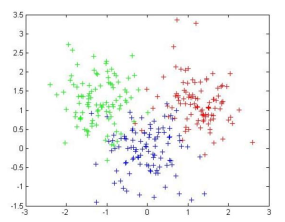
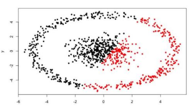
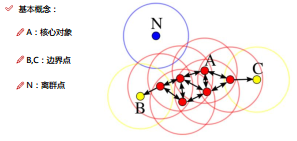
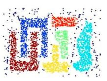
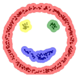
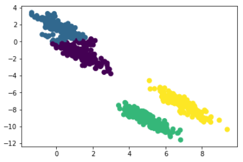
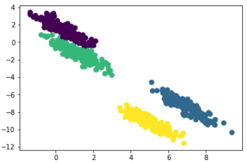
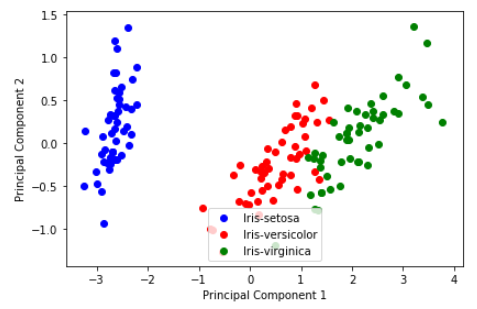

**MachineLearning**

 机器学习基础算法

# 分类算法

## 决策树

## 贝叶斯

### 贝叶斯-拼写检查器

### 贝叶斯Python文本分析

## 梯度下降求解逻辑回归

### 缺点：已实现的是一个二分类，可以进行多分类，未实现

### 优点：对梯度下降算法有着很详细的具体实现步骤，对理解梯度下降算法的具体实现有很好的借鉴意义

## 逻辑回归-信用卡欺诈检测

### 优点：对于非均衡数据的分类实现有很好的借鉴意义，采用了上采样的方法

### 缺点：已实现的是一个二分类，可以进行多分类，未实现

### 对混淆矩阵和k-fold交叉验证有很好的说明

# 聚类算法

## 聚类算法

可视化效果展示：

- [**DBScan**](https://www.naftaliharris.com/blog/visualizing-dbscan-clustering/)
- [**k-means**](https://www.naftaliharris.com/blog/visualizing-k-means-clustering/ )

### k-means

#### 介绍：基于距离的一种聚类算法

| 优点：简单，快速，适合常规数据集                  | 缺点：很难发现任意形状的簇                        |
| ------------------------------------------------- | ------------------------------------------------- |
|  |  |


### DBScan

#### 介绍：基于密度的一种聚类算法

```python
from sklearn.cluster import DBSCAN
db = DBSCAN(eps=10, min_samples=2).fit(X) #指定半径eps和密度阈值min_samples
labels = db.labels_
```

#### 优点：对于不规则数据有很好的优势



## EM（期望最大化）算法/GMM聚类：高斯混合模型

### 优点：相较与k-means只是基于距离的聚类算法而言，对于数据分布符合高斯分布的数据聚类有奇效。

### 效果对比

| k-means效果                                       | GMM效果                                           |
| ------------------------------------------------- | ------------------------------------------------- |
|  |  |


# 集成算法

# 降维算法

## LDA

### 监督性：LDA需要在有标签的情况下进行降维

```python
from sklearn.discriminant_analysis import LinearDiscriminantAnalysis as LDA

# LDA
sklearn_lda = LDA(n_components=2) #降维的维度
X_lda_sklearn = sklearn_lda.fit_transform(X, y) #导入相应的数据集及标签
X_lda_sklearn
```

## PCA

### 监督性：PCA不需要标签的情况下即可进行降维

